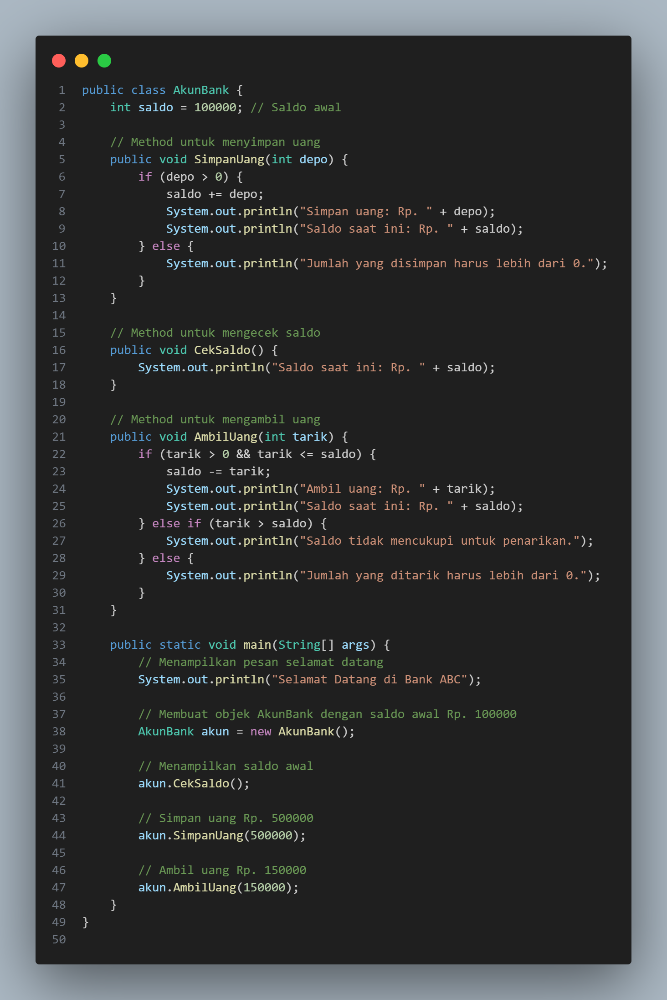
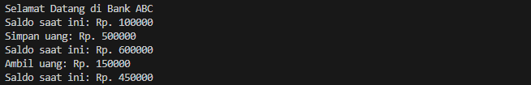

# Pemrograman Berorientasi Objek

## Latihan2

Class Person: Memiliki tiga atribut: nama, jenisKelamin, dan umur.

Konstruktor: Digunakan untuk menginisialisasi nilai atribut ketika objek Person dibuat.

Method tampilkanInfo: Method ini menampilkan informasi setiap objek Person.

Objek: Objek anton dan riko dibuat dengan atribut yang berbeda, dan informasinya ditampilkan.

outputnya 

